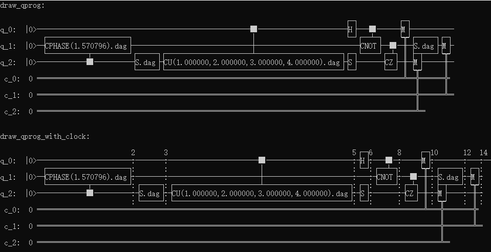

量子线路字符画
============

接口draw_qprog()可以将输入的量子程序转换为字符画并输出到控制台并保存到文件（QCircuitTextPic.txt，该接口会在当前目录下创建该txt文件，并覆盖重写），
接口详细说明如下：
::
    /**
    * @brief output a quantum prog/circuit to console by text-picture(UTF-8 encode),
             and will save the text-picture in file named QCircuitTextPic.txt in the same time in current path.
    * @param[in] prog  the source prog
    * @param[in] itr_start The start pos, default is the first node of the prog
    * @param[in] itr_end The end pos, default is the end node of the prog
    * @return the output string
    * @ Note: All the output characters are UTF-8 code.
    */
    std::string draw_qprog(QProg &prog, const NodeIter itr_start = NodeIter(), const NodeIter itr_end = NodeIter());
    
    
量子线路字符画时序表示
====================

接口draw_qprog_with_clock()可以将输入的量子程序转换为字符画并根据各种逻辑门的时序配置信息分层显示到控制台并保存信息到文件（QCircuitTextPic.txt，该接口会在当前目录下创建该txt文件，并覆盖重写），
接口功能和draw_qprog()接口功能类似，只是会在构建字符画的同时，根据逻辑门的时序信息进行分层显示。
默认的各种逻辑门时序配置如下：
::
    <QGateTimeSequence>
      <QMeasureTimeSequence>2</QMeasureTimeSequence>
      <QSwapTimeSequence>2</QSwapTimeSequence>
      <QGateControlTimeSequence>2</QGateControlTimeSequence>
      <QGateSingleTimeSequence>1</QGateSingleTimeSequence>
    </QGateTimeSequence>

可以看到目前逻辑门总共分成4种类型，除了单门占1个时序外，其他类型分别各自占用2个时序，用户可以根据实际情况自行在配置文件中配置各种逻辑门的时序信息。

.. note:: 用户可通过如下链接地址获取默认配置文件 `QPandaConfig.xml <https://github.com/OriginQ/QPanda-2/blob/master/QPandaConfig.xml>`_ , 将该默认配置文件放在执行程序同级目录下，可执行程序会自动解析该文件。

实例
---------------

::

    #include "Core/QPanda.h"
    #include <iostream>
    #include <vector>
    #include "Core/Utilities/QProgInfo/Visualization/QVisualization.h"
    #include "Core/Utilities/Tools/FillQProg.h"
    #include "Core/Core.h"
    #include <fstream>
    USING_QPANDA

    int main(void)
    {
        auto machine = initQuantumMachine(QMachineType::CPU);
	auto q = machine->allocateQubits(3);
	auto c = machine->allocateCBits(3);
	QProg prog;
	QCircuit cir2;
	QCircuit cir1;

	auto gate = S(q[1]);
	gate.setDagger(true);

	cir1 << H(q[0]) << S(q[2]) << CNOT(q[0], q[1]) << CZ(q[1], q[2]) << gate;
	cir1.setDagger(true);
	cir2 << cir1 << CU(1, 2, 3, 4, q[0], q[2]) << S(q[2]) << CR(q[2], q[1], PI / 2);
	cir2.setDagger(true);
	prog << (cir2) << (MeasureAll(q, c));

	string mmmm = draw_qprog(prog);
	cout << "draw_qprog:" << endl << mmmm << endl;

	mmmm = draw_qprog_with_clock(prog);
	cout << "draw_qprog_with_clock:" << endl << mmmm << endl;

	destroyQuantumMachine(machine);
    }

以上示例分别演示了draw_qprog和draw_qprog_with_clock这两个接口的使用方法，上述代码的输出结果如下：

   
图中，第二个量子线路图是字符画时序展示效果，每个执行时序间用虚竖线表示。

